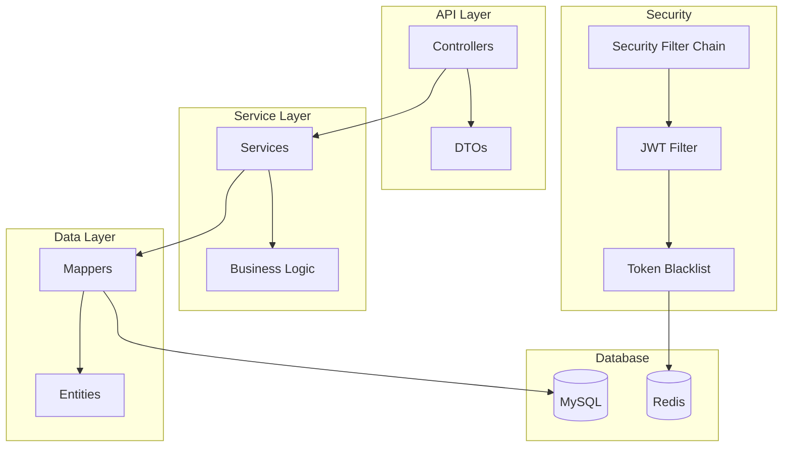

## 产品概述

后端 API 服务，提供博客系统的核心接口，包括用户认证、内容管理和文件上传功能。

## 核心功能

1. **用户认证授权模块**

- 用户注册（用户名/密码）
- 用户登录（JWT Token 认证）
- Token 黑名单管理（注销登录）
- 密码加密存储

2. **内容管理模块**

- 文章管理（CRUD、状态管理、分类/标签关联）
- 分类管理（CRUD）
- 标签管理（CRUD）
- 文章与分类、标签的多对多关系

3. **文件上传管理模块**

- 文件上传（支持图片等媒体文件）
- 文件列表查询
- 文件删除

## 技术约束

- 独立运行，暂不与前端项目集成
- 遵循 RESTful API 规范
- 提供 Swagger UI 文档
- 保持简洁的文件结构

## 技术栈

- **框架**: Spring Boot 3.2.x + Java 17 LTS
- **构建工具**: Maven
- **数据库**: MySQL 8.x
- **ORM**: MyBatis Plus 3.5.x
- **缓存**: Spring Data Redis + Lettuce
- **认证**: Spring Security + JWT (jjwt)
- **API 文档**: Knife4j 4.x (基于 OpenAPI 3)
- **工具库**: Lombok, MapStruct
- **测试**: JUnit 5, Mockito, Spring Boot Test

## 实现方案

采用分层架构：Controller -> Service -> Mapper -> Entity，遵循 SOLID 原则。使用 Spring Security 进行认证授权，JWT 作为无状态 Token，Token 黑名单使用 Redis 存储实现高性能失效管理。使用 MyBatis Plus 简化数据访问层开发。

## 架构设计



## 目录结构

```
api/
- pom.xml                           # [NEW] Maven 配置
- docs/
  - development-log.md              # [NEW] 开发历史文档
- src/main/java/com/blog/api/
  - BlogApiApplication.java         # [NEW] 应用入口
  - config/
    - SecurityConfig.java           # [NEW] Security 配置
    - Knife4jConfig.java            # [NEW] Knife4j 配置
    - CorsConfig.java               # [NEW] CORS 配置
    - MybatisPlusConfig.java        # [NEW] MyBatis Plus 配置
    - RedisConfig.java              # [NEW] Redis 配置
  - entity/
    - User.java                     # [NEW] 用户实体
    - Post.java                     # [NEW] 文章实体
    - Category.java                 # [NEW] 分类实体
    - Tag.java                      # [NEW] 标签实体
    - Media.java                    # [NEW] 媒体实体
  - mapper/
    - UserMapper.java               # [NEW] 用户 Mapper
    - PostMapper.java               # [NEW] 文章 Mapper
    - CategoryMapper.java           # [NEW] 分类 Mapper
    - TagMapper.java                # [NEW] 标签 Mapper
    - MediaMapper.java              # [NEW] 媒体 Mapper
  - service/
    - AuthService.java              # [NEW] 认证服务
    - PostService.java              # [NEW] 文章服务
    - CategoryService.java          # [NEW] 分类服务
    - TagService.java               # [NEW] 标签服务
    - MediaService.java             # [NEW] 媒体服务
    - FileStorageService.java       # [NEW] 文件存储服务
    - TokenService.java             # [NEW] Token 服务（Redis）
  - controller/
    - AuthController.java           # [NEW] 认证控制器
    - PostController.java           # [NEW] 文章控制器
    - CategoryController.java       # [NEW] 分类控制器
    - TagController.java            # [NEW] 标签控制器
    - MediaController.java          # [NEW] 媒体控制器
  - dto/
    - request/
      - LoginRequest.java           # [NEW] 登录请求
      - RegisterRequest.java        # [NEW] 注册请求
      - PostRequest.java            # [NEW] 文章请求
      - CategoryRequest.java        # [NEW] 分类请求
      - TagRequest.java             # [NEW] 标签请求
    - response/
      - AuthResponse.java           # [NEW] 认证响应
      - PostResponse.java           # [NEW] 文章响应
      - CategoryResponse.java       # [NEW] 分类响应
      - TagResponse.java            # [NEW] 标签响应
      - MediaResponse.java          # [NEW] 媒体响应
      - PageResponse.java           # [NEW] 分页响应
  - security/
    - JwtTokenProvider.java         # [NEW] JWT 提供者
    - JwtAuthenticationFilter.java  # [NEW] JWT 过滤器
    - UserDetailsServiceImpl.java   # [NEW] 用户详情服务
  - exception/
    - GlobalExceptionHandler.java   # [NEW] 全局异常处理
    - BusinessException.java        # [NEW] 业务异常
    - ErrorCode.java                # [NEW] 错误码枚举
  - util/
    - SlugUtils.java                # [NEW] Slug 工具
- src/main/resources/
  - application.yml                 # [NEW] 应用配置
  - application-dev.yml             # [NEW] 开发环境配置
  - mapper/                         # [NEW] MyBatis XML 映射文件
    - UserMapper.xml
    - PostMapper.xml
    - CategoryMapper.xml
    - TagMapper.xml
    - MediaMapper.xml
- src/test/java/com/blog/api/
  - controller/
    - AuthControllerTest.java       # [NEW] 认证控制器测试
    - PostControllerTest.java       # [NEW] 文章控制器测试
    - CategoryControllerTest.java   # [NEW] 分类控制器测试
    - TagControllerTest.java        # [NEW] 标签控制器测试
    - MediaControllerTest.java      # [NEW] 媒体控制器测试
  - service/
    - AuthServiceTest.java          # [NEW] 认证服务测试
    - PostServiceTest.java          # [NEW] 文章服务测试
```

## 关键代码结构

```java
// 用户实体（MyBatis Plus）
@Data
@TableName("user")
public class User {
    @TableId(type = IdType.AUTO)
    private Long id;
    private String username;
    private String password;
    private String email;
    private String nickname;
    private String avatar;
    private Integer status;
    private LocalDateTime createdAt;
    private LocalDateTime updatedAt;
}

// 用户 Mapper
@Mapper
public interface UserMapper extends BaseMapper<User> {
    // 继承 BaseMapper 即可拥有基础 CRUD
    // 自定义查询可在 XML 中定义
}

// Token 服务（Redis 管理）
@Service
public class TokenService {
    private final StringRedisTemplate redisTemplate;
    private static final String TOKEN_BLACKLIST_PREFIX = "token:blacklist:";

    public void addToBlacklist(String token, long expirationMillis) {
        String key = TOKEN_BLACKLIST_PREFIX + token;
        redisTemplate.opsForValue().set(key, "1", expirationMillis, TimeUnit.MILLISECONDS);
    }

    public boolean isBlacklisted(String token) {
        String key = TOKEN_BLACKLIST_PREFIX + token;
        return Boolean.TRUE.equals(redisTemplate.hasKey(key));
    }
}

// 统一响应结构
public class ApiResponse<T> {
    private int code;
    private String message;
    private T data;
    private LocalDateTime timestamp;
}

// 分页响应
public class PageResponse<T> {
    private List<T> content;
    private int pageNumber;
    private int pageSize;
    private long totalElements;
    private int totalPages;
}
```

## Agent Extensions

### Skill

- **java-dev**
- Purpose: 遵循 Java 开发规范，包括命名约定、异常处理、Spring Boot 最佳实践
- Expected outcome: 代码符合 Java 编码规范和 Spring Boot 最佳实践

### SubAgent

- **cto-vogels**
- Purpose: 技术架构设计和技术选型决策
- Expected outcome: 确保架构设计合理，技术选型正确