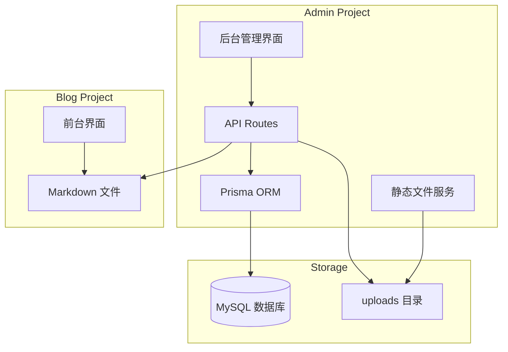

## 产品概述

在根目录独立创建 admin 后台管理系统，与现有 blog 项目解耦但保持数据兼容。采用数据库与 Markdown 文件双写策略，独立提供静态文件服务。

## 核心功能

### 1. 认证系统

- 简单密码登录（适合个人博客）
- 登录状态持久化
- 登出功能

### 2. 文章管理

- 文章列表展示（分页、搜索、筛选）
- 创建新文章（Markdown 编辑器）
- 编辑现有文章
- 删除文章
- 文章状态管理（草稿/发布）
- 双写策略：同步写入 MySQL 和 Markdown 文件

### 3. 分类与标签管理

- 分类的增删改查
- 标签的增删改查
- 统计关联文章数量

### 4. 友情链接管理

- 友链的增删改查
- 友链排序功能

### 5. 网站配置

- 站点基本信息（标题、描述）
- 作者信息管理
- 社交链接管理

### 6. 媒体资源管理

- 图片上传（admin 独立提供静态文件服务）
- 图片列表展示
- 图片删除功能
- 支持本地存储和云存储切换

### 7. 访问统计

- 集成第三方统计脚本（百度统计/Google Analytics）
- 统计代码配置入口

## 技术栈

### 后端技术

- **数据库**: MySQL 8.0+
- **ORM**: Prisma（类型安全、迁移管理）
- **认证**: iron-session（Session 管理）
- **密码加密**: bcryptjs
- **API**: Next.js API Routes
- **文件处理**: gray-matter（Markdown frontmatter 解析）

### 前端技术

- **框架**: Next.js 16 (App Router)
- **UI 库**: React 19 + TypeScript
- **样式**: Tailwind CSS 4
- **组件库**: MagicUI (https://magicui.design/docs) + shadcn/ui
- **Markdown 编辑器**: @uiw/react-md-editor
- **表单验证**: react-hook-form + zod
- **数据请求**: SWR

## 技术架构



## 双写策略说明

当 admin 创建/更新/删除文章时：

1. 写入 MySQL 数据库（主数据源，为未来 API 化准备）
2. 同步写入/更新/删除 `blog/src/data/posts/` 下的 Markdown 文件
3. 保持 blog 前台无需修改即可正常读取文章

## 媒体资源处理

- admin 上传图片存储在 `admin/public/uploads/`
- admin 独立提供静态文件服务
- 图片 URL 格式：`http://admin-domain/uploads/xxx.jpg`
- blog 前台引用时使用完整 URL

## 目录结构

```
trash-05/
├── blog/                               # 现有博客项目（保持不变）
│   ├── src/data/posts/                 # Markdown 文章目录
│   └── public/images/                  # 现有图片
│
└── admin/                              # [NEW] 后台管理系统（独立项目）
    ├── prisma/
    │   └── schema.prisma               # Prisma 数据模型定义
    ├── src/
    │   ├── app/
    │   │   ├── layout.tsx              # 根布局
    │   │   ├── page.tsx                # 后台首页/仪表盘
    │   │   ├── login/page.tsx          # 登录页面
    │   │   ├── posts/
    │   │   │   ├── page.tsx            # 文章列表
    │   │   │   ├── new/page.tsx        # 新建文章
    │   │   │   └── [id]/page.tsx       # 编辑文章
    │   │   ├── categories/page.tsx     # 分类管理
    │   │   ├── tags/page.tsx           # 标签管理
    │   │   ├── links/page.tsx          # 友链管理
    │   │   ├── config/page.tsx         # 网站配置
    │   │   ├── media/page.tsx          # 媒体管理
    │   │   └── analytics/page.tsx      # 统计配置
    │   │   └── api/
    │   │       ├── auth/
    │   │       │   ├── login/route.ts  # 登录接口
    │   │       │   ├── logout/route.ts # 登出接口
    │   │       │   └── session/route.ts# 会话检查
    │   │       ├── posts/route.ts      # 文章 CRUD
    │   │       ├── categories/route.ts # 分类 CRUD
    │   │       ├── tags/route.ts       # 标签 CRUD
    │   │       ├── links/route.ts      # 友链 CRUD
    │   │       ├── config/route.ts     # 配置 CRUD
    │   │       └── media/route.ts      # 媒体上传
    │   ├── lib/
    │   │   ├── prisma.ts               # Prisma 客户端实例
    │   │   ├── auth.ts                 # 认证工具函数
    │   │   ├── session.ts              # Session 管理
    │   │   ├── storage.ts              # 存储工具
    │   │   └── markdown-sync.ts        # Markdown 文件同步工具
    │   ├── components/
    │   │   ├── ui/                     # shadcn/ui 组件
    │   │   └── admin/
    │   │       ├── Sidebar.tsx         # 侧边栏导航
    │   │       ├── Header.tsx          # 顶部栏
    │   │       ├── AdminGuard.tsx      # 认证守卫
    │   │       ├── MarkdownEditor.tsx  # Markdown 编辑器
    │   │       ├── DataTable.tsx       # 数据表格
    │   │       └── ImageUpload.tsx     # 图片上传组件
    │   └── types/
    │       └── index.ts                # 类型定义
    ├── public/
    │   └── uploads/                    # 上传文件目录
    ├── docs/
    │   └── development-log.md          # 开发日志
    ├── .env                            # 环境变量
    ├── .env.example                    # 环境变量示例
    └── package.json
```

## 数据库设计

### 用户表 (users)

- id: int, 主键, 自增
- username: varchar(50), 唯一
- password: varchar(255), 加密存储
- created_at: datetime
- updated_at: datetime

### 文章表 (posts)

- id: int, 主键, 自增
- slug: varchar(100), 唯一, URL 友好
- title: varchar(200)
- content: text, Markdown 内容
- excerpt: text, 摘要
- cover: varchar(500), 封面图路径
- status: enum('draft', 'published')
- created_at: datetime
- updated_at: datetime
- published_at: datetime

### 分类表 (categories)

- id: int, 主键, 自增
- name: varchar(50)
- slug: varchar(50), 唯一
- description: text
- created_at: datetime

### 标签表 (tags)

- id: int, 主键, 自增
- name: varchar(50)
- slug: varchar(50), 唯一
- created_at: datetime

### 文章分类关联表 (post_categories)

- post_id: int, 外键
- category_id: int, 外键

### 文章标签关联表 (post_tags)

- post_id: int, 外键
- tag_id: int, 外键

### 友链表 (friend_links)

- id: int, 主键, 自增
- name: varchar(100)
- url: varchar(500)
- avatar: varchar(500)
- description: text
- sort_order: int, 排序
- created_at: datetime

### 网站配置表 (site_config)

- id: int, 主键
- key: varchar(50), 唯一
- value: text, JSON 格式
- updated_at: datetime

### 媒体资源表 (media)

- id: int, 主键, 自增
- filename: varchar(255)
- original_name: varchar(255)
- path: varchar(500)
- mime_type: varchar(50)
- size: int, 字节数
- storage_type: enum('local', 'cloud')
- created_at: datetime

## 实现要点

### 1. Markdown 同步工具

- 创建文章时同步生成 Markdown 文件到 blog 项目
- 更新文章时同步更新对应 Markdown 文件
- 删除文章时同步删除对应 Markdown 文件
- 使用 gray-matter 生成带 frontmatter 的 Markdown

### 2. 认证安全

- 使用 bcryptjs 加密密码（10轮 salt）
- Session 使用 iron-session 签名加密
- 登录失败限制：同一 IP 5 分钟内最多尝试 5 次

### 3. 性能优化

- 文章列表分页加载（每页 10 条）
- 图片上传前压缩（最大 2MB）
- SWR 缓存 API 响应

### 4. 错误处理

- 统一 API 错误响应格式
- 前端 Toast 提示
- 关键操作日志记录

## 设计风格

后台管理系统采用与前台一致的二次元清新风格，使用樱花粉、天空蓝、薄荷绿配色方案，毛玻璃效果和柔和动画。

### 整体布局

```
+------------------------------------------+
|              顶部导航栏                    |
|  Logo | 用户信息 | 退出登录               |
+--------+---------------------------------+
|        |                                 |
|  侧边  |          主内容区                |
|  导航  |                                 |
|        |    卡片式内容展示                 |
|  仪表盘|    毛玻璃背景效果                 |
|  文章  |    柔和阴影                      |
|  分类  |                                 |
|  标签  |                                 |
|  友链  |                                 |
|  配置  |                                 |
|  媒体  |                                 |
|  统计  |                                 |
|        |                                 |
+--------+---------------------------------+
```

### 核心页面设计

#### 1. 登录页面

- 居中卡片式登录表单
- 渐变背景装饰
- 毛玻璃效果卡片
- 简洁的用户名密码输入

#### 2. 仪表盘

- 统计卡片网格（文章数、分类数、标签数、友链数）
- 最近文章列表
- 快捷操作入口

#### 3. 文章列表

- 搜索栏和筛选器
- 数据表格（标题、分类、状态、日期、操作）
- 分页控件
- 批量操作按钮

#### 4. 文章编辑器

- 左右分栏布局
- 左侧：Markdown 编辑器
- 右侧：实时预览
- 底部：元数据配置（分类、标签、封面）

#### 5. 分类/标签管理

- 卡片列表展示
- 行内编辑功能

#### 6. 媒体管理

- 网格式图片展示
- 拖拽上传区域
- 图片预览和删除

### 动效设计

- 页面切换：淡入淡出 200ms
- 卡片悬停：轻微上浮 + 阴影增强
- 按钮点击：缩放 95% + 背景加深

## Agent Extensions

### Skill

- **ui-ux-pro-max**
- Purpose: UI/UX 设计智能化，包含 50 种样式、21 种配色、50 种字体配对、图表等
- Expected outcome: 高质量、现代化、美观的后台管理界面

- **frontend-design**
- Purpose: 创建独特的、生产级前端界面，避免通用 AI 美学
- Expected outcome: 具有高设计质量的后台管理系统，二次元清新风格

- **planning-with-files**
- Purpose: 使用文件驱动规划方式管理复杂多步骤任务
- Expected outcome: 创建 task_plan.md、findings.md、progress.md 文件，支持会话恢复

### MCP

- **playwright**
- Purpose: 进行集成测试时自动化浏览器操作
- Expected outcome: 验证登录流程、表单提交、页面交互等功能

### SubAgent

- **fullstack-dhh**
- Purpose: 技术实现方案选择和代码审查
- Expected outcome: 确保代码质量和架构合理性

## MagicUI 组件使用

MagicUI 提供丰富的动画和交互组件，将在以下场景使用：

| 组件 | 用途 | 页面 |
| --- | --- | --- |
| Shimmer Button | 微光按钮效果 | 登录按钮、操作按钮 |
| Border Beam | 边框光束效果 | 卡片容器、表单边框 |
| Marquee | 滚动展示 | 仪表盘快捷入口 |
| Bento Grid | 卡片网格布局 | 仪表盘统计卡片 |
| Text Animate | 文字动画 | 页面标题、提示信息 |
| Animated List | 动画列表 | 最近文章列表 |
| Globe | 3D 地球 | 统计页面访问来源展示 |
| Particles | 粒子效果 | 登录页背景装饰 |


详细文档: https://magicui.design/docs