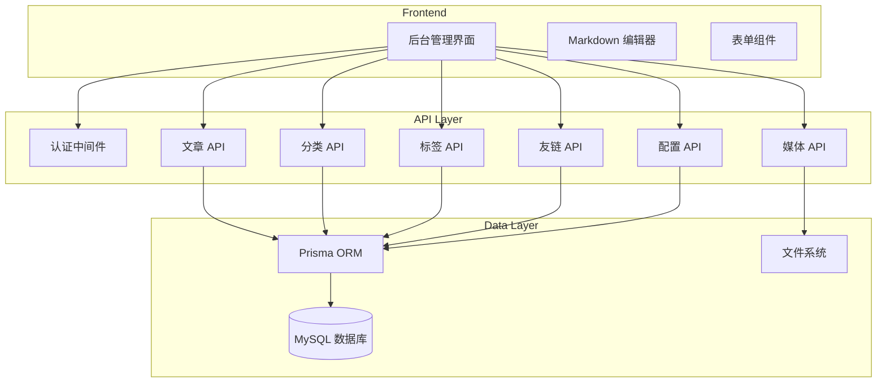

## 产品概述

为现有 Next.js 博客系统开发完整的后台管理系统，实现内容管理和网站配置功能。

## 核心功能

### 1. 认证系统

- 简单密码登录（适合个人博客）
- 登录状态持久化
- 登出功能

### 2. 文章管理

- 文章列表展示（分页、搜索、筛选）
- 创建新文章（Markdown 编辑器）
- 编辑现有文章
- 删除文章
- 文章状态管理（草稿/发布）

### 3. 分类与标签管理

- 分类的增删改查
- 标签的增删改查
- 统计关联文章数量

### 4. 友情链接管理

- 友链的增删改查
- 友链排序功能

### 5. 网站配置

- 站点基本信息（标题、描述）
- 作者信息管理
- 社交链接管理

### 6. 媒体资源管理

- 图片上传（支持本地存储和云存储切换）
- 图片列表展示
- 图片删除功能

### 7. 访问统计

- 集成第三方统计脚本（百度统计/Google Analytics）
- 统计代码配置入口

## 设计风格

- 与前台保持一致的二次元清新风格
- 使用樱花粉、天空蓝、薄荷绿配色方案
- 毛玻璃效果和柔和动画

## 技术栈

### 后端技术

- **数据库**: MySQL 8.0+
- **ORM**: Prisma（类型安全、迁移管理）
- **认证**: iron-session（Session 管理）
- **密码加密**: bcryptjs
- **API**: Next.js API Routes

### 前端技术

- **框架**: Next.js 16 (App Router)
- **UI 库**: React 19 + TypeScript
- **样式**: Tailwind CSS 4
- **组件库**: shadcn/ui（已安装）
- **Markdown 编辑器**: @uiw/react-md-editor
- **表单验证**: react-hook-form + zod
- **数据请求**: SWR

### 文件存储

- **本地存储**: public/uploads 目录
- **云存储**: 预留接口，可配置切换

## 技术架构



## 数据库设计

### 用户表 (users)

- id: int, 主键, 自增
- username: varchar(50), 唯一
- password: varchar(255), 加密存储
- created_at: datetime
- updated_at: datetime

### 文章表 (posts)

- id: int, 主键, 自增
- slug: varchar(100), 唯一, URL 友好
- title: varchar(200)
- content: text, Markdown 内容
- excerpt: text, 摘要
- cover: varchar(500), 封面图路径
- status: enum('draft', 'published')
- created_at: datetime
- updated_at: datetime
- published_at: datetime

### 分类表 (categories)

- id: int, 主键, 自增
- name: varchar(50)
- slug: varchar(50), 唯一
- description: text
- created_at: datetime

### 标签表 (tags)

- id: int, 主键, 自增
- name: varchar(50)
- slug: varchar(50), 唯一
- created_at: datetime

### 文章分类关联表 (post_categories)

- post_id: int, 外键
- category_id: int, 外键

### 文章标签关联表 (post_tags)

- post_id: int, 外键
- tag_id: int, 外键

### 友链表 (friend_links)

- id: int, 主键, 自增
- name: varchar(100)
- url: varchar(500)
- avatar: varchar(500)
- description: text
- sort_order: int, 排序
- created_at: datetime

### 网站配置表 (site_config)

- id: int, 主键
- key: varchar(50), 唯一
- value: text, JSON 格式
- updated_at: datetime

### 媒体资源表 (media)

- id: int, 主键, 自增
- filename: varchar(255)
- original_name: varchar(255)
- path: varchar(500)
- mime_type: varchar(50)
- size: int, 字节数
- storage_type: enum('local', 'cloud')
- created_at: datetime

## 目录结构

```
blog/
├── prisma/
│   └── schema.prisma                    # [NEW] Prisma 数据模型定义
├── src/
│   ├── app/
│   │   ├── admin/                       # [NEW] 后台管理路由
│   │   │   ├── layout.tsx               # 后台布局（含侧边栏）
│   │   │   ├── page.tsx                 # 后台首页/仪表盘
│   │   │   ├── login/page.tsx           # 登录页面
│   │   │   ├── posts/page.tsx           # 文章列表
│   │   │   ├── posts/new/page.tsx       # 新建文章
│   │   │   ├── posts/[id]/page.tsx      # 编辑文章
│   │   │   ├── categories/page.tsx      # 分类管理
│   │   │   ├── tags/page.tsx            # 标签管理
│   │   │   ├── links/page.tsx           # 友链管理
│   │   │   ├── config/page.tsx          # 网站配置
│   │   │   ├── media/page.tsx           # 媒体管理
│   │   │   └── analytics/page.tsx       # 统计配置
│   │   └── api/                         # [NEW] API 路由
│   │       ├── auth/login/route.ts      # 登录接口
│   │       ├── auth/logout/route.ts     # 登出接口
│   │       ├── auth/session/route.ts    # 会话检查
│   │       ├── posts/route.ts           # 文章 CRUD
│   │       ├── categories/route.ts      # 分类 CRUD
│   │       ├── tags/route.ts            # 标签 CRUD
│   │       ├── links/route.ts           # 友链 CRUD
│   │       ├── config/route.ts          # 配置 CRUD
│   │       └── media/route.ts           # 媒体上传
│   ├── lib/
│   │   ├── prisma.ts                    # [NEW] Prisma 客户端实例
│   │   ├── auth.ts                      # [NEW] 认证工具函数
│   │   ├── session.ts                   # [NEW] Session 管理
│   │   └── storage.ts                   # [NEW] 存储工具
│   ├── components/
│   │   └── admin/                       # [NEW] 后台组件
│   │       ├── Sidebar.tsx              # 侧边栏导航
│   │       ├── AdminGuard.tsx           # 认证守卫
│   │       ├── MarkdownEditor.tsx       # Markdown 编辑器
│   │       ├── DataTable.tsx            # 数据表格
│   │       ├── ImageUpload.tsx          # 图片上传组件
│   │       └── ConfigForm.tsx           # 配置表单
│   └── types/
│       └── admin.ts                     # [NEW] 后台类型定义
├── public/
│   └── uploads/                         # [NEW] 上传文件目录
└── .env                                 # [NEW] 环境变量配置
```

## 实现要点

### 1. 认证安全

- 使用 bcryptjs 加密密码（10轮 salt）
- Session 使用 iron-session 签名加密
- 登录失败限制：同一 IP 5 分钟内最多尝试 5 次

### 2. 性能优化

- 文章列表分页加载（每页 10 条）
- 图片上传前压缩（最大 2MB）
- SWR 缓存 API 响应

### 3. 错误处理

- 统一 API 错误响应格式: `{ success: false, error: string }`
- 前端 Toast 提示
- 关键操作日志记录

### 4. 数据迁移

- 创建迁移脚本将现有 Markdown 文章导入数据库
- 保持前台页面兼容性

## 设计风格

后台管理系统采用与前台一致的二次元清新风格，但在布局上采用经典的管理后台结构。

### 整体布局

```
+------------------------------------------+
|              顶部导航栏                    |
|  Logo | 用户信息 | 退出登录               |
+--------+---------------------------------+
|        |                                 |
|  侧边  |          主内容区                |
|  导航  |                                 |
|        |    卡片式内容展示                 |
|  仪表盘|    毛玻璃背景效果                 |
|  文章  |    柔和阴影                      |
|  分类  |                                 |
|  标签  |                                 |
|  友链  |                                 |
|  配置  |                                 |
|  媒体  |                                 |
|  统计  |                                 |
|        |                                 |
+--------+---------------------------------+
```

### 核心页面设计

#### 1. 登录页面

- 居中卡片式登录表单
- 渐变背景装饰
- 毛玻璃效果卡片
- 简洁的用户名密码输入

#### 2. 仪表盘

- 统计卡片网格（文章数、分类数、标签数、友链数）
- 最近文章列表
- 快捷操作入口

#### 3. 文章列表

- 搜索栏和筛选器
- 数据表格（标题、分类、状态、日期、操作）
- 分页控件
- 批量操作按钮

#### 4. 文章编辑器

- 左右分栏布局
- 左侧：Markdown 编辑器
- 右侧：实时预览
- 底部：元数据配置（分类、标签、封面）

#### 5. 分类/标签管理

- 卡片列表展示
- 行内编辑功能
- 拖拽排序

#### 6. 媒体管理

- 网格式图片展示
- 拖拽上传区域
- 图片预览和删除

### 动效设计

- 页面切换：淡入淡出 200ms
- 卡片悬停：轻微上浮 + 阴影增强
- 按钮点击：缩放 95% + 背景加深
- 表格行悬停：背景色渐变